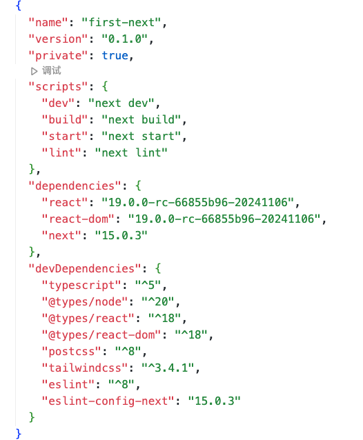

# next.js 学习笔记

## 版本信息

## 系统要求

Node.js 18.18 or later.

## 创建项目

``
npx create-next-app@latest
``

## 启动

``
 npm run dev
``

## 预览

浏览器打开 <http://localhost:3000>

## 项目结构

- 总览

 

---

- 顶层文件

---

- 路由文件

---

- 嵌套路由

---

- 动态路由

---

- 路由组和私有文件夹
  
## 定义路由

next.js 使用基于文件系统的路由

## 布局和页面
